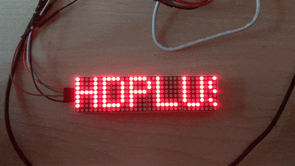
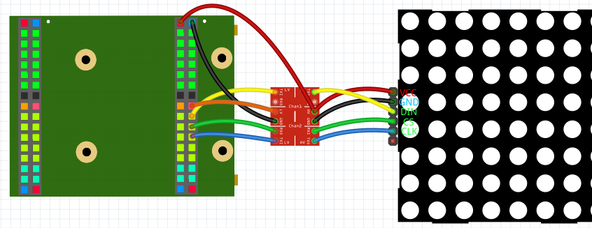

## What should I do with an LED matrix

In this tutorial we want to make an LED matrix that can display a custom text or show an image. This can be extended into a clock, games or a spectrum analyzer.



## What you need

**Important:** This are only links for the german products.<br/>

### 1. Electronics
1.  [VHDPlus Core MAX10](https://www.trenz-electronic.de/)
2.  [1 8x32 LED matrix*](https://amzn.to/36XnIUH)
3.  [1 Level shifter*](https://amzn.to/2sJ5irB)
4.  [Some jumper cables*](https://amzn.to/36MKw9h)
### 2. Soldering (level shifter)
1. [1 Soldering station + solder](https://amzn.to/36MKUEL)

*This links are Affiliate Links. By purchasing with them you support us and our work, because we get a part of the revenue as commission. You still pay the same price.

## The hardware

### Soldering

Because there are no level shifter boards pre-soldered, I would recommend learning some soldering. You could just plug the headers in the holes, but this doesn't ensure the connection and that the headers stay in place. Also soldering is pretty important for a lot of possible projects.

[Here](https://www.youtube.com/watch?v=FRWyz2Kz56s) you can see how to solder the headers to the level shifter.

### Electronics

The [led matrix](https://amzn.to/36XnIUH) have to be connected with through a level shifter with the FPGA board, because the matrix works with 5V. The level shifter converts the 3.3V outputs of the FPGA to 5V outputs. Here you can see how to connect the matrix:


5V and GND has to be conected with HV and GND of the level shifter and VCC and GND of the matrix. 3.3V has to be connected with LV of the level shifter. The 3 I/Os of the FPGA have to be connected with the LV I/Os of the level shifter. The LV I/Os then with the matrix.

## The software

Create a new project and import the LED_Matrix library folder and SPI library.
**Important:** Make sure that you assign Brightness and Shutdown values or remove them from NewComponent. Also Config has to change from '0' to '1' when the matrix is connected.
Now you can copy this example:

```
Main
(
    Button          : IN STD_LOGIC := '0';
    
    CS_O            : BUFFER STD_LOGIC := '1';
    CLK_O           : BUFFER STD_LOGIC := '0';
    DIN_O           : OUT STD_LOGIC := '0';
)
{
    CONSTANT TextScroll : BOOLEAN := true; --true = scrolling text / false = VHDP bitmap image
    
    CONSTANT Panels                : NATURAL := 4;
    CONSTANT MaxChars              : NATURAL := 32;
    
    --Define scrolling text (also can be set in process with Text and Length)
    SIGNAL LED_Matrix_Text_Text    : STD_LOGIC_VECTOR ((MaxChars*8)-1 downto 0) := s"This could be your text" & s"xxxxxxxxx"; --all bits have to be declared, so I added 9 extra chars ((MaxChars)-(Chars in Text) = 9)
    SIGNAL LED_Matrix_Text_Length  : NATURAL          range 0 to MaxChars := 23;
    
    --Needed variables to control the matrix
    SIGNAL LED_Matrix_Config       : STD_LOGIC;
    SIGNAL LED_Matrix_Panel_Bitmap : LED_Matrix_Array ((panels*8)-1 downto 0);
    SIGNAL LED_Matrix_Update       : STD_LOGIC;
    SIGNAL LED_Matrix_Set_Text     : STD_LOGIC;
    
    SIGNAL LED_Matrix_Text_Text_Matrix : LED_Matrix_Array ((panels*8)-1 downto 0);
    SIGNAL LED_Matrix_Text_Text_En     : STD_LOGIC;
    
    SIGNAL Reset : STD_LOGIC := '0';
    
    NewComponent LED_Matrix_Text
    (
        CLK_Frequency => 12000000,
        Panels        => Panels,
        MaxChars      => MaxChars,
        ScrollSpeed   => 20,

        Reset         => Reset,
        Text          => LED_Matrix_Text_Text,
        Text_Length   => LED_Matrix_Text_Length,
        Set_Text      => LED_Matrix_Set_Text,
        Scroll        => '1',
        Text_Matrix   => LED_Matrix_Text_Text_Matrix,
        Text_En       => LED_Matrix_Text_Text_En,
    );
    
    NewComponent LED_Matrix
    (
        CLK_Frequency => 12000000,
        Panels        => Panels,
        Rotate_seg    => '1',
        Mirror        => '1',

        Reset         => Reset,
        CS_O          => CS_O,
        CLK_O         => CLK_O,
        DIN_O         => DIN_O,
        
        Panel_Bitmap  => LED_Matrix_Panel_Bitmap,
        Update        => LED_Matrix_Update,
        
        Brightness    => 4,
        Shutdown      => '0',
        Config        => LED_Matrix_Config,
    );
    
    Process ()
    {
        If(TextScroll)   --second button pressed for scrolling
        {
            LED_Matrix_Panel_Bitmap <= LED_Matrix_Text_Text_Matrix;
            LED_Matrix_Update       <= LED_Matrix_Text_Text_En;
            Thread
            {
                --Load settings (brightness and shutdown)
                LED_Matrix_Config <= '0'; --Wait on start (not absolutely necessary)
                Wait(10ms);
                LED_Matrix_Config <= '1'; --Send settings
                Step{ LED_Matrix_Config <= '0'; }
                Wait(10ms);               --Waiting maybe reduce problems
                
                LED_Matrix_Set_Text     <= '0';
                While(Button = '0')  --While button not pressed -> show text
                {
                    LED_Matrix_Set_Text <= '1';
                }
                Wait(10ms);
                While(Button = '1'){}
                Wait(10ms);
                LED_Matrix_Set_Text     <= '0'; --Repeat everything after button released
            }
        }
        Else
        {
            --Define image to show
            LED_Matrix_Panel_Bitmap <=
            (   "00000000",
                "00011111",
                "00100000",
                "01000000",
                "00100000",
                "00011111",
                "00000000",
                "01111111",
                "00001000",
                "00001000",
                "00001000",
                "01111111",
                "00000000",
                "01111111",
                "01000001",
                "01000001",
                "01000001",
                "00111110",
                "00000000",
                "01111111",
                "00001001",
                "00001001",
                "00001001",
                "00000110",
                "00010000",
                "00110000",
                "01100000",
                "00110000",
                "00011000",
                "00001100",
                "00000110",
                "00000000");
            
            Thread
            {
                --Load settings (brightness and shutdown)
                LED_Matrix_Config <= '0'; --Wait on start (not absolutely necessary)
                Wait(10ms);
                LED_Matrix_Config <= '1'; --Send settings
                Step{ LED_Matrix_Config <= '0'; }
                Wait(10ms);
                
                --Update image -> show already defined image
                LED_Matrix_Update     <= '0';
                Step { LED_Matrix_Update <= '1'; }
                
                --Repeat everything after button pressed
                While(Button = '0'){}
                Wait(10ms);
                While(Button = '1'){}
                Wait(10ms);
            }
        }
    }
}
```

This example lets you display a bitmap defined with LED_Matrix_Panel_Bitmap or display a predefined text.

Make sure that you choose the correct FPGA Pins that are connected with DIN, CL and CLK, that 3.3V is connected with the level shifter and that 5V is connected with the level shifter and the matrix.

## Conclusion

With the LED matrix you have a lot of possibilities on how to output text, images or graphics. This allows to either display information like for a clock or with the possibility of setting your custom bitmap, you can show graphis e.g. for games or a spectrum analyzer. 

Here are other projects with an LED matrix:<br/>
1. [Spectrum Analyzer](https://github.com/leonbeier/VHDPlus_Libraries_and_Examples/tree/master/Examples/Basics/Spectrum_Analyzer)<br/>
2. [Clock with timer](https://github.com/leonbeier/Matrix-Clock)<br/>
3. [Custom text displayer](https://github.com/HendrikMennen/vhdplus-tests/tree/master/SerialMatrix)
## Possible problems
### Matrix is dark
1. Check if everything is connected properly (3.3V, 5V and GND connected? Does the level shifter have a connection? Correct Pins used?)
2. Is the program correct? (Shutdown => '0'? Does LED_Matrix_Config change from '0' to '1' when the matrix has power?)
3. Has the matrix a MAX7219 IC?
### Image is not displayed completely or is rotated
Try to change the parameters Panels, Rotate_seg or Mirror of the LED_Matrix instance

We hope you enjoyed the tutorial and feel free to check out 
- [Stack Overflow](https://stackoverflow.com/questions/tagged/vhdp) if you have problems
- [Youtube](https://www.youtube.com/channel/UC7qiOvlaBSiWyAb7R1xTaEw) if you are interested in more tutorials
- [Github](https://github.com/search?utf8=%E2%9C%93&q=vhdplus) for more examples and inspiration