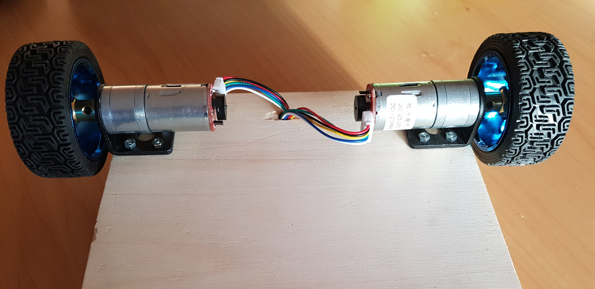
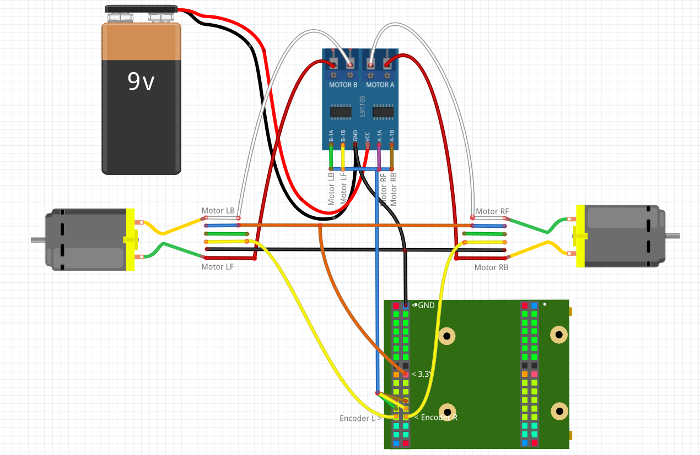
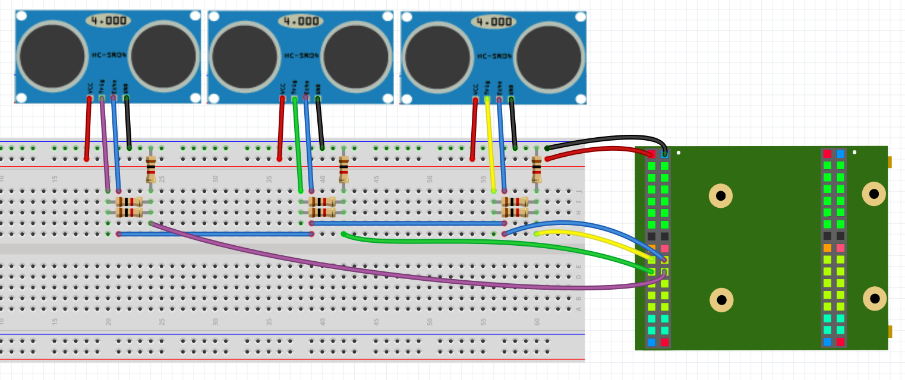

## What kind of robot?

In this tutorial we want to make a robot that can drive a pre defined route and surround objects blocking the route.


## What you need

This is a list of realy everything you need, but if you will do more projects, this includes a lot of essentials you will need for every project.

**Important:** This are only links for the german products.<br/>

### 1. Electronics
1.  [VHDPlus Core MAX10](https://www.trenz-electronic.de/)
2.  [1 Motor driver*](https://amzn.to/38JvUJG)
3.  [2 Motors with wheel and encoder*](https://amzn.to/2YZxlPF)
4.  [1-5 Ultrasonic sensors*](https://amzn.to/2Et1LjK)
5.  [1 9V block battery*](https://amzn.to/2PLVbKs)
6.  [1 USB step down converter*](https://amzn.to/34t6YCX)
7.  [3-15 1k resistors*](https://amzn.to/34oD8PP)
8.  [1 Battery clip*](https://amzn.to/2syJHlI)
9.  [1 Breadboard and some jumper cables*](https://amzn.to/2EqAjDm)
10. [1 Jumper connector kit*](https://amzn.to/2YZrY3c)
### 2. Casing
1. [Some wood* (or be creative)](https://amzn.to/2YWrn26)
2. [M3 Screws*](https://amzn.to/38LrT7K)
### 3. Tools
1. [Screwdriver*](https://amzn.to/2PQbCWg)
2. [D-SUB Crimping Tool*](https://amzn.to/2Q5JcIb)
3. [Cordless Screwdriver*](https://amzn.to/2LVNEb7)
4. [Drill bit set*](https://amzn.to/35h8qcN)

*This links are Affiliate Links. By purchasing with them you support us and our work, because we get a part of the revenue as commission. You still pay the same price.

## The hardware

### The "casing"

Be creative and invent your own casing. The easiest way is probably to take [some wood plank*](https://amzn.to/2YWrn26) and mount the motors.
If you have the [same motors as me*](https://amzn.to/2YZxlPF), take the mount, drill some holes with a [cordless screwdriver*](https://amzn.to/2rV8cth) and a 3mm drill bit and secure it with the M3 screws. This is how my solution looks like:



The same way you can mount the [ultrasonic sensors*](https://amzn.to/2Et1LjK). Ideally you have two that look to the sides and one or more that look forward, so they can detect if the robot hit something. If you bought a set of 5 sensors with mount, you can arrange them like this:


### Electronics

#### Motors
First we connect the motors like that:

You can use the [breadboard and jumper cables*](https://amzn.to/2EqAjDm) to make the connections. Use the [Jumper connector kit*](https://amzn.to/2YZrY3c) and the [D-SUB crimping tool*](https://amzn.to/2Q5JcIb) to be able to plug the motor cables in the breadboard. You can see how to do that [here](https://www.youtube.com/watch?v=M84VcMeAzzw).

The yellow cables and the [motor driver*](https://amzn.to/38JvUJG) inputs should be connected with the FPGA. The motor driver and motors have to be connected with 3.3V and GND (Blue = 3.3V and Black = GND). The [Battery*](https://amzn.to/2PLVbKs) is connected with GND and VM of the motor driver and finaly the motors have to be connected with the motor outputs of the motor driver.

To power the FPGA, you could either use a powerbank or an [USB step down converter*](https://amzn.to/34t6YCX) and connect them with an USB cable.

#### Ultrasonic sensors
Connect the ultrasonic sensors like that:

Connect the GND and VCC pins of the ultrasonic sensors with GND and VBUS of the Core Board.<br/>**Important:** Because the ultrasonic sensors work with 5V, its important to make the Echo output of the sensor 3.3V. So I used a voltage divider. You have 5V output on the top, then two [1k resistors*](https://amzn.to/34oD8PP) in parallel (this makes 0.5k) connect this with the 3.3V output and then one 1k resistor that connects that with GND.<br/>
Finaly all Echo outputs should be connected through the voltage divider (or level shifter) with the FPGA. The Trigger pins should be connected together with one FPGA pin.

## The software

Create a new project and import the Motor library folder, the PWM library and the Ultrasonic library.
Now you can copy this example:

```
Main
(
    Encoder_L           : IN STD_LOGIC;
    Encoder_R           : IN STD_LOGIC;
    Motor_LF            : BUFFER STD_LOGIC;
    Motor_LB            : BUFFER STD_LOGIC;
    Motor_RF            : BUFFER STD_LOGIC;
    Motor_RB            : BUFFER STD_LOGIC;
    
    Trigger             : OUT STD_LOGIC;
    EchoL               : IN STD_LOGIC;
    EchoF               : IN STD_LOGIC;
    EchoR               : IN STD_LOGIC;
    
    btn                 : in STD_LOGIC;
    led                 : OUT STD_LOGIC;
)
{
    --Motor controller settings
    CONSTANT Motor_Holes_In_Disk       : NATURAL := 11;   
    CONSTANT Motor_Gear_Ratio          : NATURAL := 34;    
    CONSTANT Motor_Wheel_Circumference : NATURAL := 204; 
    CONSTANT Motor_Max_Length          : NATURAL := 10000; 
    CONSTANT Motor_Route_Steps         : NATURAL := 10;    
    
    Process ()
    {
        --Tries to surround the object, if it is closer than 10cm to robot.
        If(Ultrasonic_Dist_F < 10)
        {
            Motor_Collision <= '1';
        }
        Else
        {
            Motor_Collision <= '0';
        }
        
        Motor_Route_Start <= btn;  --Starts route by pressing the button
        
        --Define the route as 80cm + 20cm forward, turn and 50cm forward
        Motor_Route_L      <= (800,  200, -310, 500, 0, 0, 0, 0, 0, 0);
        Motor_Route_R      <= (800,  200,  310, 500, 0, 0, 0, 0, 0, 0);
        --Set the speed for the route parts
        Motor_Route_Speed  <= (255,  200,  255, 255, 0, 0, 0, 0, 0, 0);
        --Set the number of route parts
        Motor_Route_Length <= 4;
    }
    
    SIGNAL Motor_Collision           : STD_LOGIC;
    SIGNAL Motor_Route_Start         : STD_LOGIC;
    SIGNAL Motor_Route_L             : Route_Array (0 to Motor_Route_Steps-1);
    SIGNAL Motor_Route_R             : Route_Array (0 to Motor_Route_Steps-1);
    SIGNAL Motor_Route_Speed         : Route_Array (0 to Motor_Route_Steps-1);
    SIGNAL Motor_Route_Length        : NATURAL     range 0 to Motor_Route_Steps;
    SIGNAL Motor_Route_Finished      : STD_LOGIC;
    
    NewComponent Motor_Route_Drive
    (
        CLK_Frequency       => 12000000,
        Route_Steps         => Motor_Route_Steps,
        Max_Length          => Motor_Max_Length,
        Turn_Length         => 155,
        Turn_Speed          => 200,
        Back_Length         => 150,
        Back_Speed          => 200,
        Clear_Area_Width    => 200,
        Side_Distances      => false,
        Check_Distance      => 300,
        Holes_In_Disk       => Motor_Holes_In_Disk,
        Gear_Ratio          => Motor_Gear_Ratio,
        Wheel_Circumference => Motor_Wheel_Circumference,
        Error_Delay         => 500,
        Correction_Step     => 1,
        Correction_Cycles   => 1,
        Length_Corr_Step    => 25,
        Max_Length_Diff     => 10,
        Accel_Length        => 100,
        Accel_Speed         => 50,
        Brake_Length        => 100,
        Brake_Speed         => 80,
        
        Reset               => '0',
        Encoder_L           => Encoder_L,
        Encoder_R           => Encoder_R,
        Motor_LF            => Motor_LF,
        Motor_LB            => Motor_LB,
        Motor_RF            => Motor_RF,
        Motor_RB            => Motor_RB,
        Collision           => Motor_Collision,
        Distance_F          => Ultrasonic_Dist_F,
        Distance_L          => Ultrasonic_Dist_L,
        Distance_R          => Ultrasonic_Dist_R,
        Route_Start         => Motor_Route_Start,
        Route_Finished      => Motor_Route_Finished,
        Route_L             => Motor_Route_L,
        Route_R             => Motor_Route_R,
        Route_Speed         => Motor_Route_Speed,
        Route_Length        => Motor_Route_Length,
    );
    
    SIGNAL Ultrasonic_Dist_L             : NATURAL   range 0 to 1000;
    
    NewComponent Ultrasonic_Controller
    (
        CLK_Frequency    => 12000000,
        Update_Frequency => 15,
        
        Reset            => '0',
        Trigger          => Trigger,
        Echo             => EchoL,
        Dist             => Ultrasonic_Dist_L,
    );
    
    SIGNAL Ultrasonic_Dist_F             : NATURAL   range 0 to 1000;
    
    NewComponent Ultrasonic_Controller
    (
        CLK_Frequency    => 12000000,
        Update_Frequency => 15,
        
        Reset            => '0',
        Echo             => EchoF,
        Dist             => Ultrasonic_Dist_F,
    );
    
    SIGNAL Ultrasonic_Dist_R             : NATURAL   range 0 to 1000;
    
    NewComponent Ultrasonic_Controller
    (
        CLK_Frequency    => 12000000,
        Update_Frequency => 15,
        
        Reset            => '0',
        Echo             => EchoR,
        Dist             => Ultrasonic_Dist_R,
    );
}
```

This example defines a simple route and by pressing the button the robot starts driving.

Make sure to set Holes_In_Disk, Gear_Ratio and Wheel_Circumference according to your motor and wheel. With Accel_Length, Accel_Speed, Brake_Length and Brake_Speed you can make driving smoother by accelerating and braking. Also check out Turn_Length, Turn_Speed, Back_Length and Back_Speed to optimize the object surrounding.

You can find the full example [here](https://github.com/leonbeier/VHDPlus_Libraries_and_Examples/tree/master/Examples/Hardware/Output/Motor_Route).

## Conclusion

The hard part is definitely the hardware and wiring, but if you finished this tutorial the real fun can begin. Try to make this your own project and e.g. let the robot bring you things. Connect it with wifi and use and app to control it or connect it with alexa to say "Alexa bring me the trashcan" and the robot comes to you. In the internet you find a lot of information to expand your project.

Here are other projects with the motor controller:<br/>
1. [Robot that protects objects on it](https://github.com/leonbeier/SGuard)

## Possible problems

First make shure that everything is connected like described and that you chose the correct pins of your fpga.

### 1. Only one wheel turns

1. When you e.g. connect the encoders correctly, but flip the right and left motor output, the robot will try to correct the speed and end up in having only one wheel turn. 
2. Turn the wheel of the spinning motor and check if the encoder input changes it's state (e.g. by connecting the encoder input with the led). If not, check every part between encoder and fpga, if everything is connected. You can use a multimeter and check if the voltage changes between 0 and 3V when you turn the wheel.

### 2. No wheel turns

1. Make sure that Route_Steps is not 0 and that the lengths are > 0.
2. Error_Delay is maybe too low (if CLK_Frequency is correct this is in ms)
3. Make sure that there is a signal at the motor output pins (with a multimeter or by connecting the signal with an LED).
   - If there is an output, check if the motor driver is working, by connecting the input pin directly with 3.3V. Check with a multimeter the voltages of the motor driver in and outputs. If it outputs voltage, check the connection between driver and motor. Otherwise maybe try a different motor driver.
   - If there is not output at the motor pins, check if you chose the correct pins and that Route_Start changes from '0' to '1' at the beginning (you have to press the button to start driving).

### 3. Both wheels turn, but in opposite direction

Check which wheel truns backwards and switch the connection of the M1 and M2 motor driver output.

### 4. The wheels are working but don't drive the desired lenghts

Check the Holes_In_Disk, Gear_Ratio and Wheel_Circumference parameters again. Holes_In_Disk is the number of changes from '0' to '1' of the encoder input for one wheel turn. Gear_Ratio can be found in the motor description (1:90 = 90). Wheel_Circumference is the diameter of the wheel (in mm) times 3.14 (pi). Finaly check if all your distances are in mm (1m = 100cm = 1000mm).

### 5. The robot doesn't drive streight

With Correction_Step, Correction_Cycles, Length_Corr_Step and Max_Length_Diff you can adjust this. 
1. If the encoder spins very quickly and the speed changes to heavily, increase Correction_Cycles and Max_Length_Diff and decrease Correction_Step and Length_Corr_Step.
2. If the encoder is e.g. connected directly with the wheel and spins not that quickly, decrease Correction_Cycles and Max_Length_Diff and increase Correction_Step and Length_Corr_Step.
3. If this doesn't help, you can try to change the Debounce_Cycles constant in the Motor_Route_Drive library.

### 6. The robot doesn't drive all route parts

- Check if Route_Steps is correct.
- Maybe Brake_Speed is too high and the motor hasn't enought power at the end

### 7. The robot drives the wrong route

- Check if Collision is '0'
- Error_Delay is maybe too low (if CLK_Frequency is correct this is in ms)
- Maybe the left and right motors are switched
- check if the lengths are correct (see 4.)

### 8. The robot doesn't stop precisely enought

You can set the length and amount of speed difference (0-255) with that the motor should brake. Brake_Length sets the length at the end of a route part, in that the robot should decelerate (in mm). With Brake_Speed you can set how much the robot should brake. Be cautious that the robot has enought power at the end of the route part to finish it. 

We hope you enjoyed the tutorial and feel free to check out 
- [Stack Overflow](https://stackoverflow.com/questions/tagged/vhdp) if you have problems
- [Youtube](https://www.youtube.com/channel/UC7qiOvlaBSiWyAb7R1xTaEw) if you are interested in more tutorials
- [Github](https://github.com/search?utf8=%E2%9C%93&q=vhdplus) for more examples and inspiration